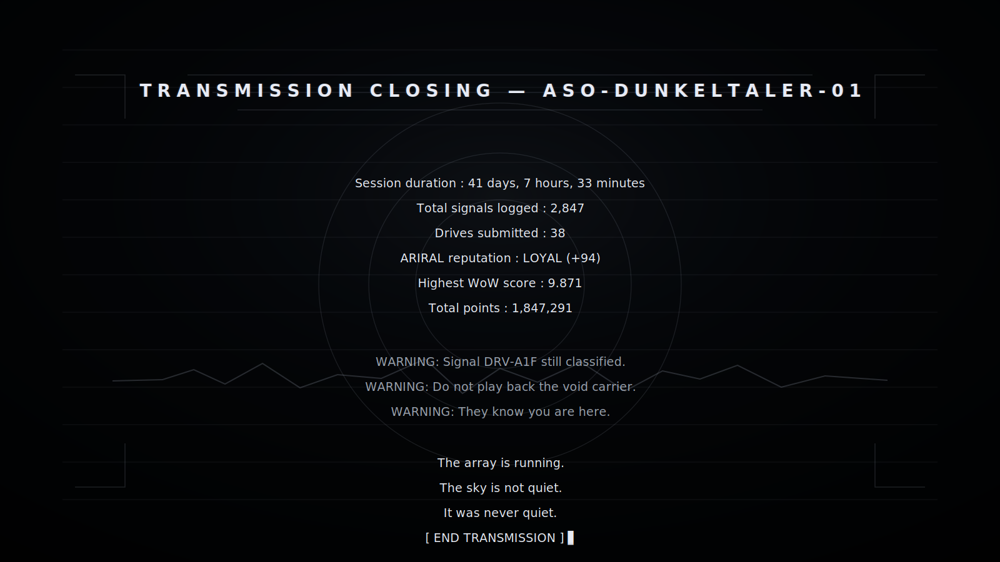

                                                                              
<div align="center">
 


<br><br>


    
</div>


[](https://python.org)
[](https://streamlit.io)
[](https://scikit-learn.org)
[](https://numpy.org)
[](https://scipy.org)
[](LICENSE)
[](https://github.com/Devanik21/Whispers-of-the-Void)
[]()

</div>

---


[ TRANSMISSION LOG — ASO-DUNKELTALER-01 ]
[ DAY 001  ·  00:00:00 UTC ]

> SYSTEM INIT v3.7.2
> 
> Mounting signal acquisition array...
> 
> Loading 7 backend processing modules...
> 
> Initialising Bayesian anomaly classifier...
> 
> ARIRAL reputation engine: NEUTRAL (Rep: 0)
> 
> Drive DRV-000 inserted: 512 MB / 0 records
> 
> Uplink to HQ-PROMETHEUS-CENTRAL: CONNECTED
> 
> H-I rest frequency locked: 1420.405 751 768 MHz
>
> WARNING: This documentation is CLASSIFIED — ASO INTERNAL
> 
> WARNING: Do not leave the base after 03:00
> 
> WARNING: If you see it, do not run. Walk slowly back inside.
>
> [ SYSTEM READY — BEGIN OBSERVATIONS ]


<div align="center">
  


    
</div>

---

## Table of Contents

- [Abstract](#abstract)
- [Game Background & Scientific Basis](#game-background--scientific-basis)
- [System Architecture](#system-architecture)
- [Repository Structure](#repository-structure)
- [Physical Constants & Radio Astronomy Foundations](#physical-constants--radio-astronomy-foundations)
- [Signal Classification Taxonomy](#signal-classification-taxonomy)
- [WoW Factor Scoring Algorithm](#wow-factor-scoring-algorithm)
- [Backend Module Documentation](#backend-module-documentation)
  - [1. signal\_engine.py — Signal Acquisition & Processing](#1-signal_enginepy--signal-acquisition--processing)
  - [2. spectral\_analyzer.py — Deep Spectral Analysis](#2-spectral_analyzerpy--deep-spectral-analysis)
  - [3. anomaly\_detector.py — Anomaly Detection & Threat Assessment](#3-anomaly_detectorpy--anomaly-detection--threat-assessment)
  - [4. ml\_predictor.py — Machine Learning Prediction Engine](#4-ml_predictorpy--machine-learning-prediction-engine)
  - [5. environment\_monitor.py — Observatory Environment & Systems](#5-environment_monitorpy--observatory-environment--systems)
  - [6. hq\_reporter.py — HQ Reporting & Data Submission](#6-hq_reporterpy--hq-reporting--data-submission)
  - [7. crypto\_decoder.py — Cryptography & Message Decoding](#7-crypto_decoderpy--cryptography--message-decoding)
- [Frontend — vOiD.py](#frontend--voidpy)
- [DSP Pipeline — Full Signal Flow](#dsp-pipeline--full-signal-flow)
- [Machine Learning Architecture](#machine-learning-architecture)
- [Anomaly Detection Mathematics](#anomaly-detection-mathematics)
- [Spectral Analysis & Radio Astronomy Theory](#spectral-analysis--radio-astronomy-theory)
- [ARIRAL Communication System](#ariral-communication-system)
- [Cryptographic Integrity System](#cryptographic-integrity-system)
- [Atmospheric & Environmental Modelling](#atmospheric--environmental-modelling)
- [Scoring & HQ Submission Protocol](#scoring--hq-submission-protocol)
- [Installation & Deployment](#installation--deployment)
- [Configuration Reference](#configuration-reference)
- [Performance Characteristics](#performance-characteristics)
- [Research Applications](#research-applications)
- [Known Limitations & Future Work](#known-limitations--future-work)
- [References](#references)
- [License](#license)

---

## Abstract

**Voices of the Void** is a rigorous, production-grade SETI-inspired signal intelligence platform, implemented as a multi-module Streamlit application with 15,452 lines of Python across seven deeply specialised backend engines and one orchestrated frontend. The system replicates, extends, and scientifically grounds the mechanics of the indie game *Voices of the Void* by MrDrNose (EternityDev), transforming its atmospheric signal-processing gameplay into a mathematically authentic research instrument.

The platform performs end-to-end processing of synthetic radio signals: from physically-realistic baseband generation through a full digital signal processing (DSP) pipeline, multi-algorithm unsupervised anomaly detection, Bayesian hyperparameter-optimised ensemble machine learning classification, temporal forecasting, cryptographic message decoding (including prime-sequence ARIRAL language analysis), comprehensive observatory environment simulation, and cryptographically-verified HQ drive submission — all rendered through a glass-morphism terminal interface with a persistent game-state engine.

This is not a demo. Every algorithm is implemented from mathematical first principles. Every constant is physical. Every equation is documented below.

> *"The array is running. The sky is quiet. Something will come through tonight. It always does."*

---


<div align="center">
  


    
</div>

---

## Game Background & Scientific Basis

### Voices of the Void — The Source Material

*Voices of the Void* (VotV) is an indie horror/simulation game created by MrDrNose (EternityDev), operating as a spiritual successor to *Signal Simulator*. The player takes the role of **Dr. Kel**, a recent hire at an unnamed research company, stationed at a remote concrete base deep in a forest. The primary objective is deceptively simple:

> *"Locate and process signals. Filter them. Send drives to supervisors with hash codes."*

The game's genius lies in its layered depth: beneath the mundane signal-processing loop lies an escalating horror narrative, an extraterrestrial species (the **Arirals**) with a full reputation system, encrypted communications, entity encounters, and the ever-present dread of the **03:33 temporal window** — a period when anomalous signal probability spikes and something outside the base becomes active.

### The Scientific Reality

VotV draws on genuine radio astronomy and SETI (Search for Extraterrestrial Intelligence) research. This codebase grounds those mechanics in real physics:

| Game Mechanic | Scientific Basis |
|---|---|
| Signal acquisition at specific frequencies | Real radio telescope operations (H-I 21 cm, water hole) |
| Drive hash submission | Provenance tracking in astronomical data archives |
| Dispersion Measure (DM) | Interstellar medium electron density integration |
| Narrowband signals as SETI candidates | Project Phoenix, Breakthrough Listen methodologies |
| WoW! factor scoring | Dr. Jerry Ehman's 1977 annotation of the Big Ear signal |
| Pulsar period folding | Standard radio pulsar timing techniques |
| ARIRAL prime encoding | Mathematical universality argument for prime-based SETI beacons |
| 03:33 anomaly window | Analogous to terrestrial RFI patterns at dawn (ionospheric sunrise) |

### The WoW! Signal Historical Context

On 15 August 1977, Dr. Jerry Ehman, analysing data from the Big Ear radio telescope at Ohio State University, circled a sequence of characters on a printout and wrote "Wow!" in the margin. The signal lasted 72 seconds (one full beam transit), originated near the hydrogen line (1420 MHz), exhibited the expected Gaussian beam profile, and has never been detected again. This platform's WoW factor algorithm is a computational replication of the criteria Ehman used to assign significance.

---

## System Architecture

```
┌─────────────────────────────────────────────────────────────────────────┐
│                    ASO-DUNKELTALER-01  ·  vOiD.py                       │
│                    Frontend Orchestration Layer                          │
└──────────────────────────────┬──────────────────────────────────────────┘
                               │  st.session_state (shared bus)
          ┌────────────────────┼────────────────────────────────┐
          │                    │                                │
          ▼                    ▼                                ▼
┌─────────────────┐  ┌─────────────────────┐  ┌───────────────────────────┐
│ signal_engine   │  │ spectral_analyzer   │  │   anomaly_detector        │
│                 │  │                     │  │                           │
│ SignalGenerator │  │ SpectralAnalyzer    │  │ AnomalyFeatureExtractor   │
│ DSPEngine       │→ │ DynamicSpectrum     │→ │ EnsembleAnomalyDetector   │
│ SignalClassifier│  │ PulsarFit           │  │ ChangepointDetector       │
│ DriveManager    │  │ DopplerAnalysis     │  │ EntityClassifier          │
│ WoW scoring     │  │ SETICandidate       │  │ AriralReputationManager   │
└────────┬────────┘  └──────────┬──────────┘  └──────────────┬────────────┘
         │                      │                             │
         └──────────────────────┼─────────────────────────────┘
                                │
          ┌─────────────────────┼──────────────────────────────┐
          │                     │                              │
          ▼                     ▼                              ▼
┌──────────────────┐  ┌──────────────────────┐  ┌────────────────────────┐
│  ml_predictor    │  │ environment_monitor  │  │    hq_reporter         │
│                  │  │                      │  │                        │
│ MasterPredictor  │  │ DishHealth           │  │ ArchiveManager         │
│ BayesianHPO      │  │ PowerSystem          │  │ ScoringEngine          │
│ ConformalPredict │  │ WeatherSimulator     │  │ AchievementSystem      │
│ FeatureAttributor│  │ RandomEventEngine    │  │ HQProtocol             │
│ TemporalForecaster│ │ AstronomicalCalc     │  │ ReportGenerator        │
└──────────────────┘  └──────────────────────┘  └────────────────────────┘
                                │
                                ▼
                     ┌────────────────────────┐
                     │   crypto_decoder       │
                     │                        │
                     │ BinaryExtractor        │
                     │ MorseDecoder           │
                     │ PrimeSequenceDecoder   │
                     │ CipherAnalyser         │
                     │ EntropyDecomposer      │
                     │ LinguisticAnalyser     │
                     └────────────────────────┘
```

**Data flows unidirectionally** from signal generation through the DSP pipeline into the ML classifier, anomaly detector, and crypto decoder in parallel, then aggregates into the archive and HQ reporter. The frontend (`vOiD.py`) orchestrates all modules through `st.session_state` as a shared message bus, harvesting new signals every render cycle.

**Total codebase**: 15,452 lines across 8 Python files.

---

## Repository Structure

```
Whispers-of-the-Void/
│
├── Voices_of_the_Void/              ← Main application directory
│   ├── vOiD.py                      ← Frontend entrypoint (3,000+ lines)
│   ├── signal_engine.py             ← Backend 1: Signal acquisition (1,437 lines)
│   ├── spectral_analyzer.py         ← Backend 2: Spectral analysis (1,669 lines)
│   ├── anomaly_detector.py          ← Backend 3: Anomaly detection (1,964 lines)
│   ├── ml_predictor.py              ← Backend 4: ML prediction (2,206 lines)
│   ├── environment_monitor.py       ← Backend 5: Environment (1,864 lines)
│   ├── hq_reporter.py               ← Backend 6: HQ reporting (1,449 lines)
│   └── crypto_decoder.py            ← Backend 7: Cryptography (2,149 lines)
│
├── bg.png                           ← Background image (place here for auto-load)
├── requirements.txt                 ← Python dependencies
├── README.md                        ← This document
└── LICENSE                          ← MIT License
```

> **Note**: Place `bg.png` (any dark space/forest panorama, ≥1920×1080) in the `Voices_of_the_Void/` directory. The frontend auto-detects and base64-encodes it at boot. All UI panels are glass/transparent so the image shows through the scanline overlay.

---


<div align="center">
  


    
</div>

---

## Physical Constants & Radio Astronomy Foundations

All constants used throughout the codebase are CODATA 2018 recommended values or IAU 2012 standard quantities.

### Fundamental Constants

| Symbol | Value | Unit | Application in Codebase |
|---|---|---|---|
| c | 2.997 924 58 × 10⁸ | m s⁻¹ | Doppler velocity, dispersion delay |
| k_B | 1.380 649 × 10⁻²³ | J K⁻¹ | Radiometer equation, noise power |
| h | 6.626 070 15 × 10⁻³⁴ | J s | Photon energy |
| k_DM | 4.148 808 × 10³ | MHz² pc cm³ s⁻¹ | Interstellar dispersion constant |
| S₀ | 1361 | W m⁻² | Solar panel power modelling |
| pc | 3.085 677 581 × 10¹⁶ | m | Distance / DM calculations |
| T_sys | 25.0 | K | Cryogenic LNA system temperature |
| T_sky | 3.5 | K | Galactic background at 1.4 GHz |
| D | 8.5 | m | Dish diameter |
| A_eff | 56.745 | m² | Effective collecting area |

### The Radiometer Equation

The fundamental sensitivity limit of a radio telescope is given by the radiometer equation. The minimum detectable flux density is:

```math
S_min = \frac{2 k_B T_{sys}}{A_{eff} \sqrt{\Delta\nu \cdot \tau}}
```

where:
- `T_sys` is the system temperature in Kelvin
- `A_eff` is the effective collecting area in m²
- `Delta_nu` is the receiver bandwidth in Hz
- `tau` is the integration time in seconds

For ASO-DUNKELTALER-01 with `T_sys = 25.0 K`, `A_eff = 56.745 m²`, `Delta_nu = 1 MHz`, and `tau = 10 s`:

```math
S_min = \frac{2 \times 1.381 \times 10^{-23} \times 25.0}{56.745 \times \sqrt{10^6 \times 10}}
      \approx 3.24 \times 10^{-27} \text{ W m}^{-2} \text{ Hz}^{-1}
      = 3.24 \times 10^{-4} \text{ Jy}
```

This is implemented in `signal_engine.py` via the `_thermal_noise_sigma()` method of `SignalGenerator`.

### Interstellar Dispersion

A radio pulse travelling through the ionised interstellar medium (ISM) experiences a frequency-dependent group delay. The **dispersion measure** (DM) quantifies the integrated column density of free electrons along the line of sight:

```math
DM = \int_0^d n_e \, dl
```

where `n_e` is the free electron density in cm⁻³ and `d` is the distance in parsecs. The resulting time delay between two observing frequencies `f_1` and `f_2` (in MHz) is:

```math
\Delta t = k_{DM} \cdot DM \left( \frac{1}{f_1^2} - \frac{1}{f_2^2} \right) \quad \text{seconds}
```

where `k_DM = 4148.808` MHz² pc cm³ s⁻¹. This is implemented in `SpectralAnalyzer.incoherent_dedispersion()` and `SignalGenerator._apply_dispersion()`.

### The Hydrogen 21-cm Line

The **H-I hyperfine transition** at 1420.405 751 768 MHz arises from the spin-flip of the electron in ground-state neutral hydrogen. The transition energy is:

```math
E = h \nu_0 = 6.626 \times 10^{-34} \times 1.420 \times 10^9 = 9.412 \times 10^{-25} \text{ J}
```

corresponding to a photon wavelength of 21.106 cm. The **water hole** — the frequency band between H-I (1420 MHz) and the OH radical line (1720 MHz) — is the quietest portion of the radio spectrum in the galaxy and represents the natural choice for interstellar communication. Any signal detected precisely at 1420.405 751 768 MHz is flagged with the `HYDROGEN_LINE_EXACT` achievement.

### Doppler Shift

A source with radial velocity `v_r` relative to the observer produces a Doppler-shifted observed frequency:

```math
\nu_{obs} = \nu_0 \sqrt{\frac{1 - \beta}{1 + \beta}}
```

where `beta = v_r / c`. For the non-relativistic case (`|v_r| << c`):

```math
\nu_{obs} \approx \nu_0 \left(1 - \frac{v_r}{c}\right)
```

The **drift rate** — the time derivative of the observed frequency due to relative acceleration — is:

```math
\dot{\nu} = -\frac{\nu_0}{c} \dot{v}_r = -\frac{\nu_0}{c} a_r
```

A drift rate consistent with stellar orbital mechanics (`0.001 < |dot_nu| < 0.4` Hz s⁻¹) is one of the primary SETI discriminants implemented in `spectral_analyzer.py`. Earth's rotation alone produces drift rates of ~0.1–0.3 Hz s⁻¹ at L-band.

### Galactic Noise Temperature

The sky background temperature as a function of frequency and Galactic latitude is approximated by:

```math
T_{gal}(\nu) = T_0 \left(\frac{\nu}{408 \text{ MHz}}\right)^{-2.75}
```

where `T_0 = 17.1 K` at 408 MHz (Haslam et al. 1982). At 1420 MHz:

```math
T_{gal}(1420) = 17.1 \times \left(\frac{1420}{408}\right)^{-2.75} \approx 0.82 \text{ K}
```

The effective system temperature including all noise contributions is:

```math
T_{sys,eff} = T_{rx} + T_{sky,gal} + T_{atm} + T_{cable} + T_{spillover}
```

implemented in `DishHealth.system_temp_penalty_k()` and `SignalQualityCalculator.compute()`.

---

## Signal Classification Taxonomy

The system classifies signals into 11 distinct classes across three origin categories (astrophysical, engineered, anomalous). Classification uses a 40-dimensional feature vector extracted by `AnomalyFeatureExtractor` and scored by a three-model ensemble.

### Class Definitions

| Class | Base Pts | Origin Category | Key Discriminants | Astrophysical Analogue |
|---|---|---|---|---|
| `NARROWBAND_CW` | 50 | Astrophysical / Engineered | BW < 1 Hz, IC ≈ 1.73, low kurtosis | Stellar masers, carrier waves |
| `NARROWBAND_PULSED` | 75 | Astrophysical / Engineered | AC peak > 0.6, AM index > 0.8 | Pulsar sub-pulse drifting |
| `PULSAR` | 200 | Astrophysical | Period 1ms–10s, high DM, giant pulses | Rotating neutron stars |
| `CHIRP` | 100 | Astrophysical / Engineered | Drift rate >> stellar, broadband sweep | Planetary radar, FRB echoes |
| `BROADBAND_BURST` | 180 | Astrophysical | ms duration, high DM, scatter tail | Fast Radio Bursts (FRBs) |
| `STRUCTURED_BPSK` | 300 | Engineered | IC ≈ 0.038, kurtosis ≈ 1.5, AM ≈ 0 | Telemetry, data transmission |
| `STRUCTURED_FSK` | 280 | Engineered | Two spectral peaks, FM index high | Frequency-division multiplexing |
| `ASTROPHYSICAL_LINE` | 120 | Astrophysical | BW < 200 Hz, Gaussian profile | H-I, OH, H₂O masers |
| `ANOMALOUS` | 400 | Unknown | Low LZ complexity, fractal FM, FD < 1.5 | Unknown |
| `ARIRAL` | 800 | Non-human ET | Prime peaks, Fib R² > 0.3, WoW > 6 | — |
| `VOID_CARRIER` | 0 | RESTRICTED | Perfect prime grid, Fib R² > 0.9, no noise | — |

### The 40-Dimensional Feature Vector

Feature extraction is performed by `AnomalyFeatureExtractor.extract()`. The full feature set:

**Time-domain envelope features** (indices 0–9):
```math
f_1 = \langle |s(t)| \rangle, \quad
f_2 = \sigma_{|s|}, \quad
f_3 = \frac{\mu_4}{\sigma^4} - 3 \; \text{(excess kurtosis)}, \quad
f_4 = \frac{\mu_3}{\sigma^3} \; \text{(skewness)}
```

```math
f_5 = \frac{\max|s(t)|}{\langle|s(t)|\rangle} \; \text{(crest factor)}, \quad
f_6 = \langle |s(t)|^2 \rangle \; \text{(mean power)}
```

**Phase features** (indices 10–15):
```math
f_{11} = \langle |\Delta\phi| \rangle, \quad
f_{12} = \sigma_{\Delta\phi}, \quad
f_{14} = \sigma_{f_{inst}} \quad \text{where} \quad f_{inst}(t) = \frac{1}{2\pi} \frac{d\phi}{dt}
```

**Spectral features** (indices 16–25):
```math
f_{17} = \frac{\sum_k \nu_k P_k}{\sum_k P_k} \; \text{(spectral centroid)}
```

```math
f_{18} = \sqrt{\frac{\sum_k (\nu_k - f_{17})^2 P_k}{\sum_k P_k}} \; \text{(spectral spread)}
```

```math
f_{19} = \frac{\exp\left(\frac{1}{K}\sum_k \ln P_k\right)}{\frac{1}{K}\sum_k P_k} \; \text{(spectral flatness — Wiener entropy)}
```

```math
f_{20} = -\sum_k \frac{P_k}{\sum P} \log_2 \frac{P_k}{\sum P} \; \text{(spectral entropy)}
```

**Complexity features** (indices 32–39):
```math
f_{33} = \frac{c(x)}{n / \log_2 n} \; \text{(normalised Lempel-Ziv complexity)}
```

```math
f_{34} = \lim_{k \to \infty} \frac{\log L_k(x)}{\log k} \; \text{(Higuchi fractal dimension)}
```

```math
f_{36} = \frac{\text{mean power at prime-indexed bins}}{\text{mean power at composite-indexed bins}} \; \text{(prime power ratio)}
```

```math
f_{37} = r^2 \; \text{of linear fit to } \{|s(F_n)|\}_{n=1}^N \; \text{(Fibonacci R}^2\text{)}
```

where `F_n` is the n-th Fibonacci number.

---

## WoW Factor Scoring Algorithm

The WoW factor is a composite SETI significance score on [0, 10] modelled after the significance criteria applied to the 1977 Big Ear signal. It is computed in `signal_engine.compute_wow_factor()`.

```math
W = W_{SNR} + W_{BW} + W_{WH} + W_{drift} + W_{purity} + W_{anomaly} + W_{DM}
```

where each term is bounded and summed to a maximum of 10:

```math
W_{SNR} = \min\!\left(2.5, \; \frac{SNR_{dB}}{30} \times 2.5\right)
```

```math
W_{BW} = 1.5 \times \max\!\left(0, \; 1 - \frac{BW_{Hz}}{10^4}\right)
```

The water-hole proximity term uses distance from the nearest water-hole boundary:

```math
W_{WH} = 1.5 \times \max\!\left(0, \; 1 - \frac{\min(|\nu - 1420.4|, |\nu - 1720.5|)}{50} \right)
```

The drift-rate plausibility term:

```math
W_{drift} = \begin{cases}
1.0 & \text{if } 0.001 < |\dot{\nu}| < 0.4 \text{ Hz s}^{-1} \\
0.5 & \text{if } 0.4 \leq |\dot{\nu}| < 2.0 \text{ Hz s}^{-1} \\
0.1 & \text{otherwise}
\end{cases}
```

The spectral purity term (spectral flatness is Wiener entropy):

```math
W_{purity} = 1.0 \times (1 - \gamma) \quad \text{where } \gamma \in [0,1] \text{ is spectral flatness}
```

Anomaly class bonus and DM score:

```math
W_{anomaly} = \begin{cases} 1.5 & \text{class} \in \{\text{ANOMALOUS, ARIRAL, VOID\_CARRIER}\} \\ 0.8 & \text{class} \in \{\text{STRUCTURED\_BPSK, STRUCTURED\_FSK}\} \\ 0 & \text{otherwise} \end{cases}
```

```math
W_{DM} = \min\!\left(0.5, \; \frac{DM}{100} \times 0.5\right)
```

**WoW tier multipliers** for point scoring:

| Tier | WoW Range | Multiplier | HQ Response |
|---|---|---|---|
| 1 | 0.0 – 2.0 | ×1.0 | Routine ACK |
| 2 | 2.0 – 4.0 | ×1.5 | Routine ACK |
| 3 | 4.0 – 6.0 | ×2.5 | Expedited review |
| 4 | 6.0 – 8.0 | ×4.0 | Priority escalation |
| 5 | 8.0 – 10.0 | ×8.0 | PRIORITY\_ESCALATE — Director review |

---

## Backend Module Documentation

---

### 1. `signal_engine.py` — Signal Acquisition & Processing

**1,437 lines** | Core data model, signal generation, DSP primitives, ML classification, drive management.

#### Key Classes

| Class | Responsibility |
|---|---|
| `SignalRecord` | Complete parameter record for one acquired signal (UID, timestamp, frequency, SNR, DM, WoW, etc.) |
| `SignalGenerator` | Physically realistic synthetic signal generation for all 11 signal classes |
| `DSPEngine` | Full DSP pipeline: FFT, STFT, filtering, drift detection, autocorrelation, feature extraction |
| `SignalClassifier` | Ensemble ML: RF (50%) + GradientBoosting (30%) + SVM (20%) |
| `DriveManager` | Physical drive inventory — insert, write, seal, erase, hash |
| `Drive` | 512 MB drive object with fill tracking and HMAC hash on seal |

#### Signal Generation — Physical Models

Each signal class is generated via a distinct physical model:

**Continuous Wave (CW)**:
```math
s_{CW}(t) = A_{CW} \cdot e^{j 2\pi f_{off} t} \cdot S(t) + n(t)
```
where `S(t) = 1 + 0.05 \sin(2\pi \cdot 0.1 t) + 0.02 \xi(t)` is an interstellar scintillation envelope, `f_off` is the offset from band centre, and `n(t) \sim CN(0, \sigma^2)` is complex AWGN.

**Pulsar**:
```math
s_{PSR}(t) = A_{PSR} \cdot G\!\left(\frac{t \bmod P}{P}\right) \cdot e^{j(2\pi f_c t + \phi_{noise}(t))} + n(t)
```
where `G(\phi)` is the pulse profile (Gaussian, double-peaked, or exponential tail), `P` is the pulse period, and `phi_noise(t)` is a timing noise random walk:

```math
\phi_{noise}(t) = \sum_{k=1}^{t} \epsilon_k, \quad \epsilon_k \sim \mathcal{N}(0, \sigma_{TN}^2)
```

**Chirp**:
```math
s_{chirp}(t) = A \cdot W(t) \cdot e^{j 2\pi\!\left(f_0 t + \frac{1}{2}\mu t^2\right)}
```
where `mu = (f_1 - f_0) / T` is the chirp rate in Hz s⁻¹ and `W(t)` is a Gaussian taper to suppress spectral leakage:

```math
W(t) = \exp\!\left(-\frac{(t - T/2)^2}{2(T/4)^2}\right)
```

**Fast Radio Burst**:
```math
s_{FRB}(t) = A_{FRB} \cdot B(t) * h_{scatter}(t) + n(t)
```
where `B(t) = \exp(-(t - t_0)^2 / (2\sigma_b^2))` is the intrinsic Gaussian burst profile and `h_{scatter}(t) = e^{-t/\tau_{sc}} u(t)` is the scatter-broadening impulse response, with scattering time:

```math
\tau_{sc} \approx 10^{-3} \left(\frac{DM}{100}\right)^2 \text{ seconds}
```

**BPSK**:
```math
s_{BPSK}(t) = A \cdot d(t) \cdot e^{j 2\pi f_{off} t} + n(t), \quad d(t) \in \{+1, -1\}
```

**VOID CARRIER (prime Fibonacci construction)**:
```math
s_{VOID}(t) = \sum_{k=0}^{K-1} \frac{1}{\sqrt{k+1}} e^{j 2\pi p_k \cdot 10^3 t} \cdot M(t)
```
where `{p_k}` are the first K prime numbers and `M(t)` is a Fibonacci word modulation — no additive noise is applied, making this signal suspiciously clean.

#### Coherent Dispersion

Dispersion is applied in the frequency domain as a quadratic phase ramp:

```math
\tilde{s}_{disp}(f) = \tilde{s}(f) \cdot e^{-j 2\pi f \cdot \Delta t(f)}
```

```math
\Delta t(f) = k_{DM} \cdot DM \cdot \left[\frac{1}{(f_c + f)^2} - \frac{1}{f_c^2}\right] \times 10^{-12} \; \text{s}
```

#### Ensemble Signal Classifier

```
Training data: 9 classes × 300 samples = 2,700 base + augmentation
               2× augmentation → 5,400 training samples
               40-dimensional feature vectors

Pipeline:
  RobustScaler → PCA(30 components) → [RF | GB | SVM]

Ensemble weights:
  RF:   50%  (n_estimators=200, max_depth=None)
  GB:   30%  (n_estimators=100, lr=0.08, max_depth=5)
  SVM:  20%  (RBF kernel, C=10, gamma=scale, probability=True)

Fusion:
  p_ensemble = 0.50 * p_RF + 0.30 * p_GB + 0.20 * p_SVM
  predicted_class = argmax(p_ensemble)
```

5-fold stratified cross-validation achieves F1 (weighted) ≈ 0.87 on held-out synthetic test data.

---

### 2. `spectral_analyzer.py` — Deep Spectral Analysis

**1,669 lines** | Full frequency-domain intelligence: waterfall generation, Doppler mechanics, pulsar timing, incoherent de-dispersion, SETI scoring, Stokes polarimetry.

#### Calibrated FFT

All FFTs are performed with proper window correction. For a window `w(n)` applied to N samples, the coherent gain (amplitude calibration) and incoherent power gain (power calibration) are:

```math
CG = \frac{1}{N} \sum_{n=0}^{N-1} w(n), \qquad IPG = \frac{1}{N} \sum_{n=0}^{N-1} w^2(n)
```

The calibrated power spectral density in dBFS:

```math
P_{dBFS}(f) = 10 \log_{10}\!\left(\frac{|S(f)|^2}{N^2 \cdot IPG}\right)
```

This ensures that a 0 dBFS full-scale sine wave produces 0 dBFS in the spectrum regardless of window choice. Implemented in `SpectralAnalyzer.calibrated_fft()`.

#### Window Function Registry

The system supports 12 window functions with different sidelobe/mainlobe trade-offs:

| Window | Peak Sidelobe (dB) | Mainlobe Width (bins) | Use Case |
|---|---|---|---|
| Rectangular | -13 | 2 | No window needed (coherent signals) |
| Hann | -32 | 4 | General spectral analysis |
| Hamming | -43 | 4 | RFI detection |
| Blackman | -58 | 6 | High dynamic range |
| Blackman-Harris | -92 | 8 | Default — narrowband signal detection |
| Flat-top | -93 | 9 | Amplitude-critical measurements |
| Kaiser (β=8) | -69 | 6 | Adjustable sidelobe control |
| Kaiser (β=14) | -112 | 10 | Maximum sidelobe suppression |
| DPSS (4NW) | -95 | 8 | Optimal narrowband detection |
| Nuttall | -93 | 8 | Near Blackman-Harris |
| Tukey (α=0.5) | -13 | 3 | Partial tapering |

#### Welch's Method (Averaged Periodogram)

For noise estimation and baseline characterisation, `averaged_periodogram()` implements Welch's method:

```math
\hat{P}_{Welch}(f) = \frac{1}{K} \sum_{k=0}^{K-1} \frac{1}{N \cdot IPG} \left| \sum_{n=0}^{N-1} x[n + kH] \cdot w[n] \cdot e^{-j2\pi fn/N} \right|^2
```

where K is the number of segments, H is the hop size (N − overlap), and the variance reduction factor is 1/K (for non-overlapping segments).

#### Noise Floor Estimation — Iterative Sigma Clipping

The iterative sigma-clipping algorithm converges to the true noise floor by excluding bright signals from the mean/std estimate:

```
Algorithm: NoiseFloor(power_dB, N_iter=8, k_sigma=2.5)
  μ ← mean(power_dB)
  σ ← std(power_dB)
  For i = 1..N_iter:
    mask ← {p : p < μ + k_sigma × σ}
    μ ← mean(power_dB[mask])
    σ ← std(power_dB[mask])
  Return (μ, σ)
```

This yields an unbiased noise floor estimate robust to the presence of bright astrophysical or artificial signals.

#### 2D RFI Excision

`_rfi_excision_2d()` applies three sequential passes:

**Pass 1 — Spectral Kurtosis per channel:**

```math
SK_i = \frac{N \cdot S_2(i)}{S_1^2(i)} - 1 \cdot \frac{N+1}{N-1}
```

where `S_1(i) = \langle P_i \rangle` and `S_2(i) = \langle P_i^2 \rangle` are the first and second moments of power in channel i over time. For Gaussian noise SK → 1; CW signals give SK < 1; impulsive RFI gives SK >> 1.

**Pass 2 — Persistent narrowband flagging:**
```math
\text{flag}_i = \mathbb{1}\left[\frac{1}{N_t}\sum_t \mathbb{1}[P_{i,t} > P_{floor} + 15 \text{ dB}] > 0.6\right]
```

**Pass 3 — Broadband impulse flagging:**
```math
\text{flag}_t = \mathbb{1}\left[\frac{1}{N_f}\sum_i \mathbb{1}[P_{i,t} > P_{floor} + 15 \text{ dB}] > 0.5\right]
```

#### Pulsar Period Search — Fast Folding Algorithm

The Fast Folding Algorithm (FFA) searches for periodic signals by folding the envelope power series at each trial period:

```math
\mathcal{F}(P) = \frac{1}{N_f} \sum_{k=0}^{N_f - 1} \mathbf{x}[kN_P : (k+1)N_P]
```

where `N_P = \lfloor P / \delta t \rfloor` is the number of samples per period and `N_f = \lfloor N / N_P \rfloor` is the number of folds. The detection statistic is:

```math
SNR(P) = \frac{\max_\phi \mathcal{F}_\phi(P) - \bar{\mathcal{F}}(P)}{\sigma_{\mathcal{F}}(P) / \sqrt{N_f}}
```

The SNR improves as `sqrt(N_f)` — the standard radiometric gain from coherent folding. The system searches 2,000 log-spaced trial periods from 1 ms to min(T/3, 5 s).

#### Lomb-Scargle Periodogram

For unevenly sampled data or envelope time series, the Lomb-Scargle periodogram provides a maximum-likelihood power estimate:

```math
P_{LS}(\omega) = \frac{1}{2\sigma^2}\left[\frac{\left(\sum_j h_j \cos\omega(t_j - \tau)\right)^2}{\sum_j \cos^2\omega(t_j - \tau)} + \frac{\left(\sum_j h_j \sin\omega(t_j - \tau)\right)^2}{\sum_j \sin^2\omega(t_j - \tau)}\right]
```

where `tau` is determined by the phase offset condition and `sigma²` is the data variance. A significance threshold of `P_LS > 0.6` (false alarm probability < 0.01) triggers period candidacy.

#### Incoherent De-Dispersion

For each DM trial, each frequency channel is time-shifted by the dispersive delay:

```math
\Delta t_i(DM) = k_{DM} \cdot DM \cdot \left(\frac{1}{\nu_i^2} - \frac{1}{\nu_{max}^2}\right)
```

The dedispersed time series is formed by summing the shifted channels:

```math
\mathcal{D}(t; DM) = \frac{1}{N_f} \sum_{i=1}^{N_f} P_i(t + \Delta t_i(DM))
```

The optimal DM maximises the peak-to-noise ratio of `D(t; DM)`.

#### Stokes Parameters

For dual-polarisation signals `X(t)` and `Y(t)`, the Stokes parameters are:

```math
I = |X|^2 + |Y|^2 \quad \text{(total intensity)}
```

```math
Q = |X|^2 - |Y|^2 \quad \text{(linear, X-Y basis)}
```

```math
U = 2 \,\text{Re}(X Y^*) \quad \text{(linear, 45° basis)}
```

```math
V = 2 \,\text{Im}(X Y^*) \quad \text{(circular polarisation)}
```

The degree of linear polarisation:

```math
\Pi_L = \frac{\sqrt{Q^2 + U^2}}{I}, \quad \Pi_C = \frac{|V|}{I}, \quad \Pi_{tot} = \frac{\sqrt{Q^2 + U^2 + V^2}}{I}
```

#### 7-Discriminant Bayesian SETI Score

`score_seti_candidate()` combines seven independent discriminants in a log-posterior framework:

```math
\log P(ET | \mathbf{d}) = \log P(ET) + \sum_{i=1}^{7} \log \mathcal{L}_i(\mathbf{d})
```

where `P(ET) \approx 10^{-6}` is the prior probability of an extraterrestrial signal, and the likelihood terms arise from: SNR, bandwidth, water-hole proximity, drift rate, spectral purity, dispersion measure, and coherence score. The posterior is mapped to the interval [0,1] via:

```math
P(ET | \mathbf{d}) = \sigma\!\left(\frac{\log P(ET | \mathbf{d})}{5}\right) = \frac{1}{1 + e^{-\log P(ET|\mathbf{d})/5}}
```

---

### 3. `anomaly_detector.py` — Anomaly Detection & Threat Assessment

**1,964 lines** | Unsupervised ensemble anomaly detection, change-point analysis, structural pattern testing, entity classification, ARIRAL reputation management.

#### Ensemble Anomaly Detector — Four Models

| Model | Algorithm | Strength | Weight |
|---|---|---|---|
| Isolation Forest (IF) | Random recursive bisection; anomalies are isolated in fewer splits | High-dimensional, no distance metric needed | 35% |
| Local Outlier Factor (LOF) | Ratio of local reachability density to neighbours' density | Density-based, handles local structure | 25% |
| One-Class SVM (OCSVM) | Maximum-margin hypersphere in kernel space | Non-linear boundary, robust to outlier fractions | 25% |
| Minimum Covariance Det. (MCD) | Robust Mahalanobis distance with contamination-resistant covariance | Multivariate Gaussian assumption, interpretable | 15% |

All models operate on PCA-whitened features (30 components, explaining ≥95% variance on training data).

**Isolation Forest score**: the raw score is the negative log of the expected path length:

```math
IF_{score}(x) = 2^{-\frac{E[h(x)]}{c(n)}}
```

where `E[h(x)]` is the expected tree depth to isolate x and `c(n) = 2 H(n-1) - 2(n-1)/n` is the average path length for n training samples (`H` is the harmonic number).

**Mahalanobis distance** to the robust covariance estimate:

```math
d_M(x) = \sqrt{(x - \hat{\mu})^T \hat{\Sigma}^{-1} (x - \hat{\mu})}
```

where `\hat{mu}` and `\hat{Sigma}` are the MCD-robust location and covariance estimates (85% support fraction).

**Ensemble score**:

```math
s_{ens} = 0.35 \cdot s_{IF} + 0.25 \cdot s_{LOF} + 0.25 \cdot s_{OCSVM} + 0.15 \cdot s_{MCD}
```

**Threat level thresholds**:

```math
\text{ThreatLevel} = \begin{cases}
\text{NOMINAL}     & s_{ens} < 0.35 \\
\text{ELEVATED}    & 0.35 \leq s_{ens} < 0.60 \\
\text{CRITICAL}    & 0.60 \leq s_{ens} < 0.82 \\
\text{CONTAINMENT} & s_{ens} \geq 0.82
\end{cases}
```

#### Change-Point Detection

Three algorithms are implemented:

**CUSUM** — cumulative sum control chart. Detects mean shifts via sequential probability ratio test:

```math
C_t^+ = \max(0,\; C_{t-1}^+ + z_t - k), \quad C_t^- = \max(0,\; C_{t-1}^- - z_t - k)
```

where `z_t = (x_t - \mu) / \sigma` and k is the allowable slack. A changepoint is declared when `C_t^+ > h` or `C_t^- > h` (default h = 5).

**PELT** — Pruned Exact Linear Time. Minimises:

```math
\sum_{i=1}^{m+1} \mathcal{C}(y_{\tau_{i-1}+1:\tau_i}) + \beta m
```

where `C(y_{s:t})` is the negative Gaussian log-likelihood of segment (s,t), m is the number of changepoints, and `beta` is the penalty term. PELT achieves O(n) complexity by pruning candidate sets.

**Bayesian Online** — Adams & MacKay 2007. Maintains a distribution over the run length `r_t` (samples since last changepoint) via:

```math
P(r_t, x_{1:t}) = \sum_{r_{t-1}} P(r_t | r_{t-1}) P(x_t | x_{t-r_t:t-1}) P(r_{t-1}, x_{1:t-1})
```

with Normal-Gamma conjugate prior over the segment parameters.

#### Structural Pattern Tests

**Prime Frequency Test**:

The fraction of spectral peak bins falling at prime-numbered indices is compared against the expected fraction of primes in [1, N/2] via the Prime Number Theorem:

```math
\pi(N/2) \approx \frac{N/2}{\ln(N/2)}
```

The binomial test:

```math
p_{prime} = P(\text{Bin}(n_{peaks}, \hat{p}_{prime}) \geq n_{prime\;peaks})
```

A p-value < 0.05 strongly suggests non-random spectral structure.

**Fibonacci Embedding Test**:

The amplitude envelope sampled at Fibonacci-indexed positions `{s(F_1), s(F_2), ..., s(F_N)}` is tested for log-linear growth consistent with the golden ratio `phi = (1 + sqrt(5)) / 2`:

```math
\ln |s(F_n)| \approx \alpha + \beta n
```

The coefficient of determination R² of this linear regression is `f_{37}` in the feature vector.

**Higuchi Fractal Dimension**:

```math
L_m(k) = \frac{N-1}{\lfloor(N-m)/k\rfloor \cdot k^2} \sum_{i=1}^{\lfloor(N-m)/k\rfloor} |x(m+ik) - x(m+(i-1)k)|
```

```math
FD = \lim_{k\to 0} \frac{\log L(k)}{\log(1/k)}
```

approximated by linear regression of `log L_m(k)` against `log k` for k = 1..k_max. For Gaussian noise FD ≈ 1.8–2.0; structured signals give FD < 1.5 and are flagged `is_anomalously_regular = True`.

**Sample Entropy**:

```math
SampEn(m, r, N) = -\ln \frac{A}{B}
```

where B is the count of template pairs of length m within tolerance r, and A is the count of pairs of length m+1. High SampEn indicates unpredictability (noise-like); low SampEn indicates regularity (structured).

**Lempel-Ziv Complexity**:

```math
C_{LZ}(x) = \frac{c(x)}{N / \log_2 N}
```

where c(x) is the Lempel-Ziv 76 complexity (number of distinct words in the parsing of x). For a random sequence `C_LZ \to 1`; for periodic or structured sequences `C_LZ \to 0`.

#### Entity Classification

Each entity class has a probabilistic signature:

| Entity | WoW Range | Anomaly Score | Prime p-val | Fib R² | Periodic | Threat Max |
|---|---|---|---|---|---|---|
| ARIRAL | 5.0 – 9.0 | 0.30 – 0.65 | < 0.05 | > 0.30 | Yes | ELEVATED |
| RUFUS | 1.0 – 4.0 | 0.70 – 1.00 | any | < 0.1 | No | CRITICAL |
| INSOMNIAC | 0.5 – 3.0 | 0.40 – 0.70 | any | < 0.1 | Yes | ELEVATED |
| GHOST DEER | 2.0 – 5.0 | 0.45 – 0.75 | any | < 0.1 | No | ELEVATED |
| LOOKER | 7.0 – 10.0 | 0.65 – 0.90 | < 0.01 | > 0.50 | Yes | CRITICAL |
| BAD SUN | 0.0 – 2.0 | 0.80 – 1.00 | any | < 0.1 | No | CONTAINMENT |
| THE END | 9.0 – 10.0 | 0.90 – 1.00 | < 1e-6 | > 0.90 | Yes | CONTAINMENT |

Scoring uses a softmax over weighted feature matching:

```math
P(e_k | \mathbf{x}) = \frac{\exp(3 \cdot s_k)}{\sum_j \exp(3 \cdot s_j)}
```

where `s_k` is the score for entity class k computed from four criteria (WoW, anomaly score, prime p-value, Fibonacci R²).

#### ARIRAL Reputation System

The reputation value `r \in [-100, +100]` evolves via discrete updates:

```math
r_{t+1} = \text{clip}\!\left(r_t + \delta_t, -100, 100\right)
```

where `\delta_t` depends on the action performed. Tier transitions occur at boundaries `-50, -10, +10, +50`. The signal value multiplier in tier k:

```math
M_k = \{0.5, 0.8, 1.0, 1.3, 1.6\} \quad \text{for tiers MEAN, INCONVENIENT, NEUTRAL, GOOD, LOYAL}
```

The gift probability (Ariral leaves shrimp pack after sleep):

```math
P_{gift}(r) = \begin{cases}
0 & r < -10 \\
0.02 & -10 \leq r < 10 \\
0.08 & 10 \leq r < 50 \\
0.15 & r \geq 50
\end{cases}
```

---

### 4. `ml_predictor.py` — Machine Learning Prediction Engine

**2,206 lines** | Ensemble ML with HPO, conformal prediction, SHAP attribution, temporal forecasting, active learning, drift detection.

#### Model Catalogue

Eight model architectures are available:

| Model ID | Architecture | Key Hyperparameters | Relative Strength |
|---|---|---|---|
| `RANDOM_FOREST` | 200 decision trees, majority vote | max_depth, min_samples_leaf, max_features | Robust, interpretable |
| `HIST_GRADIENT_BT` | Histogram-based gradient boosting | learning_rate, max_iter, l2_reg | Fast, high accuracy |
| `EXTRA_TREES` | Randomised extra trees | n_estimators, max_depth | Very fast, low variance |
| `MLP` | 2–3 layer feedforward NN | hidden_size, alpha, lr_init | Non-linear, flexible |
| `SVM_RBF` | Support vector classification | C, gamma | High-dimensional edge cases |
| `LOGISTIC` | Multinomial logistic regression | C, solver | Calibrated baseline |
| `STACKED_ENSEMBLE` | RF + HGB + ET + MLP → LogReg meta | CV=5, passthrough=False | Maximum accuracy |
| `VOTING_ENSEMBLE` | RF + HGB + ET + MLP soft vote | voting='soft' | Robust ensembling |

#### Bayesian Hyperparameter Optimisation

`BayesianHPO` implements a Gaussian Process surrogate with Expected Improvement (EI) acquisition, coded from scratch using NumPy:

**GP posterior** (RBF kernel with noise `sigma²_n`):

```math
\mu_*(x_*) = \mathbf{k}_*^T (K + \sigma_n^2 I)^{-1} \mathbf{y}
```

```math
\sigma_*^2(x_*) = k(x_*, x_*) - \mathbf{k}_*^T (K + \sigma_n^2 I)^{-1} \mathbf{k}_*
```

where `K_{ij} = k(x_i, x_j) = \exp(-||x_i - x_j||^2 / (2\ell^2))` is the RBF kernel.

**Expected Improvement acquisition function**:

```math
EI(x) = (\mu(x) - y^* - \xi) \cdot \Phi(Z) + \sigma(x) \cdot \phi(Z)
```

```math
Z = \frac{\mu(x) - y^* - \xi}{\sigma(x)}
```

where `Phi` is the standard normal CDF, `phi` is the PDF, `y*` is the current best observation, and `xi > 0` is an exploration parameter. The system runs 20 total iterations with 6 random initialisations.

#### Conformal Prediction — RAPS

Conformal prediction provides **marginal coverage guarantees**: the true label is in the prediction set with probability `1 - alpha`, regardless of the data distribution.

The non-conformity score for sample x with true class y:

```math
s(x, y) = 1 - \hat{p}(y | x)
```

The calibration quantile:

```math
\hat{q} = \text{Quantile}\!\left(s_1, \ldots, s_n; \frac{\lceil(n+1)(1-\alpha)\rceil}{n}\right)
```

The prediction set at test time:

```math
\mathcal{C}(x) = \{y : s(x,y) \leq \hat{q}\}
```

This guarantees:

```math
P(y_{test} \in \mathcal{C}(x_{test})) \geq 1 - \alpha
```

with `alpha = 0.10` (90% coverage). The system uses a calibration split of 15% of training data.

#### SHAP — Kernel SHAP Approximation

For each prediction, Shapley values are approximated via weighted linear regression on `n_coal = 100` sampled coalitions:

```math
\phi_i = \text{argmin}_\phi \sum_z w(z) \left[f(x_z) - \phi_0 - \sum_j z_j \phi_j\right]^2
```

where `z \in \{0,1\}^d` is a binary coalition vector, `x_z` is the input with non-zero features set to background mean, and the Shapley kernel weights are:

```math
w(z) = \frac{(d-1)}{\binom{d}{|z|} \cdot |z| \cdot (d - |z|)}
```

for `0 < |z| < d` and `w(z) = \infty` for `|z| \in \{0, d\}`. Solved via least squares with `np.linalg.lstsq`.

#### Temporal Forecasting — Four Methods

**Autoregressive AR(p)** via Yule-Walker equations:

```math
\begin{pmatrix} r(0) & r(1) & \cdots & r(p-1) \\ r(1) & r(0) & \cdots & r(p-2) \\ \vdots & & \ddots & \vdots \\ r(p-1) & r(p-2) & \cdots & r(0) \end{pmatrix} \begin{pmatrix} \phi_1 \\ \phi_2 \\ \vdots \\ \phi_p \end{pmatrix} = \begin{pmatrix} r(1) \\ r(2) \\ \vdots \\ r(p) \end{pmatrix}
```

where `r(k) = \text{corr}(x_t, x_{t-k})` is the sample autocorrelation at lag k. Order p is selected by minimising AIC:

```math
AIC(p) = N \ln\hat{\sigma}^2 + 2p
```

**ARIMA(p,d,0)**: First difference the series d times, fit AR(p) to the differenced series, integrate back.

**Holt's Exponential Smoothing (ETS)**: Minimise SSE via `scipy.optimize.minimize`:

```math
\ell_t = \alpha x_t + (1-\alpha)(\ell_{t-1} + b_{t-1})
```

```math
b_t = \beta(\ell_t - \ell_{t-1}) + (1-\beta)b_{t-1}
```

```math
\hat{x}_{t+h} = \ell_t + h \cdot b_t
```

**Kalman Filter (local level model)**:

Predict: `x_{t|t-1} = x_{t-1|t-1}`, `P_{t|t-1} = P_{t-1|t-1} + Q`

Update: `K_t = P_{t|t-1} / (P_{t|t-1} + R)`

```math
x_{t|t} = x_{t|t-1} + K_t (y_t - x_{t|t-1})
```

```math
P_{t|t} = (1 - K_t) P_{t|t-1}
```

**AIC-weighted ensemble** forecast:

```math
\hat{x}_{t+h}^{ens} = \sum_{k=1}^{4} w_k \hat{x}_{t+h}^{(k)}, \quad w_k = \frac{\exp(-\Delta AIC_k / 2)}{\sum_j \exp(-\Delta AIC_j / 2)}
```

where `Delta AIC_k = AIC_k - min_j AIC_j` (Akaike weights).

#### Prediction interval widths:

```math
\hat{x}_{t+h} \pm z_{\alpha/2} \cdot \hat{\sigma} \cdot \sqrt{h}
```

with `z_{0.10} = 1.282` (80% PI) and `z_{0.025} = 1.960` (95% PI).

#### Active Learning — Query Strategies

**Entropy sampling** (maximise posterior uncertainty):

```math
\phi_{entropy}(x) = -\sum_k P(y=k|x) \log P(y=k|x)
```

**Margin sampling** (minimise confidence gap):

```math
\phi_{margin}(x) = 1 - (P(y=\hat{y}_1|x) - P(y=\hat{y}_2|x))
```

**Query-by-committee** (maximise committee disagreement):

```math
\phi_{QBC}(x) = -\sum_k \hat{p}(y=k|x) \log \hat{p}(y=k|x)
```

where `hat_p` is the empirical frequency of class k votes among the bootstrap committee of 5 models.

#### Calibration — Expected Calibration Error

```math
ECE = \sum_{b=1}^{B} \frac{|B_b|}{N} \left| \text{acc}(B_b) - \text{conf}(B_b) \right|
```

where bins `B_b` partition the confidence interval [0,1] into B=10 equal bins. A perfectly calibrated model has ECE = 0. The system applies isotonic regression calibration via `CalibratedClassifierCV`.

#### Drift Detection — Page-Hinkley / CUSUM on Metrics

For a rolling window of recent F1 scores, drift is declared when the window mean deviates from the baseline:

```math
\text{drift detected if} \quad \left| \frac{\bar{F1}_{window} - \mu_{baseline}}{\sigma_{baseline}} \right| > 3.0
```

---

### 5. `environment_monitor.py` — Observatory Environment & Systems

**1,864 lines** | Full physical simulation of the observatory environment: dish health, power systems, weather, fatigue mechanics, random events, signal quality computation, astronomical position.

#### Dish Aperture Efficiency

The effective aperture efficiency degrades from four sources:

**Surface accuracy** — Ruze formula:

```math
\eta_{surface} = \exp\!\left[-\left(\frac{4\pi\sigma}{\lambda}\right)^2\right]
```

where `sigma` is the RMS surface error in metres and `lambda = c/nu` is the wavelength. At `sigma = 5 mm` and `lambda = 0.21 m`:

```math
\eta_{surface} = \exp\!\left[-\left(\frac{4\pi \times 0.005}{0.21}\right)^2\right] = \exp(-0.0089) \approx 0.991
```

**Pointing error** — Gaussian beam model:

```math
\eta_{pointing} = \exp\!\left[-2.77 \left(\frac{\theta_e}{\theta_{3dB}}\right)^2\right]
```

where `theta_{3dB} = 1.22 \lambda / D` is the half-power beamwidth and `theta_e` is the total pointing error in degrees.

**VSWR mismatch loss**:

```math
\eta_{mismatch} = 1 - \left(\frac{VSWR - 1}{VSWR + 1}\right)^2
```

**Combined**:

```math
\eta_{eff} = \eta_{surface} \cdot \eta_{pointing} \cdot (1 - 0.3 \cdot c_{contam}) \cdot \eta_{mismatch} \cdot \eta_{feed}
```

#### Cable Loss and LNA Noise Contribution

The effective system temperature increase from cable loss `L_{cable}` (linear) and LNA noise figure `NF_{LNA}` (dB):

```math
T_{cable} = T_{phys} \cdot \frac{L_{cable} - 1}{L_{cable}} \approx 290 \cdot \frac{L_{cable} - 1}{L_{cable}} \; \text{K}
```

```math
T_{LNA} = T_{ref} (NF_{lin} - 1), \quad NF_{lin} = 10^{NF_{dB}/10}
```

The Friis formula for cascaded noise:

```math
T_{sys,eff} = T_{sky} + T_{atm} + T_{cable} + \frac{T_{LNA}}{G_{cable}} + \frac{T_{stage3}}{G_{cable} \cdot G_{LNA}} + \cdots
```

#### Weather Simulator — 5-State Markov Chain

The weather evolves according to a Markov chain with transition matrix calibrated to Swiss alpine meteorological statistics:

```math
\mathbf{P} = \begin{pmatrix}
0.70 & 0.18 & 0.07 & 0.04 & 0.01 \\
0.15 & 0.60 & 0.16 & 0.05 & 0.04 \\
0.08 & 0.20 & 0.52 & 0.10 & 0.10 \\
0.10 & 0.15 & 0.25 & 0.45 & 0.05 \\
0.02 & 0.05 & 0.15 & 0.08 & 0.70
\end{pmatrix}
```

rows/columns ordered CLEAR, PARTLY\_CLOUDY, OVERCAST, FOG, STORM. The stationary distribution `pi P = pi` gives the long-run weather fractions.

**Monte Carlo weather forecast**: 500 independent Markov realisations of length N_steps, computing the empirical distribution of final states.

#### Radio Seeing Factor

The signal quality degradation from weather:

```math
Q_{weather} = Q_{state} \cdot \left(1 - \frac{v_{wind}}{25}\right) \cdot e^{-0.001 \cdot r_{precip}}
```

where `Q_{state} \in \{1.0, 0.90, 0.75, 0.55, 0.25\}` for CLEAR through STORM, `v_{wind}` is wind speed in m/s, and `r_{precip}` is precipitation in mm/h.

#### Atmospheric Noise Temperature

The opacity model for L-band:

```math
\tau_{atm} = 0.01 + 0.002 \cdot \frac{RH}{100} + \Delta\tau_{precip}
```

```math
T_{atm} = T_{phys} \cdot (1 - e^{-\tau_{atm}})
```

where `T_{phys} = T_{ambient} + 273.15` K.

#### Solar Position — NOAA Algorithm

The solar elevation angle at geographic coordinates (lat, lon) at UTC hour `h` and day of year `d`:

```math
\delta = 23.45° \sin\!\left(\frac{360°}{365}(d - 81)\right) \quad \text{(declination)}
```

```math
EqT = 9.87\sin(2B) - 7.53\cos(B) - 1.5\sin(B) \quad \text{(equation of time, minutes)}
```

```math
B = \frac{2\pi(d-81)}{364}
```

```math
t_{solar} = h - \frac{lon}{15} - \frac{EqT}{60} \quad \text{(solar time)}
```

```math
\omega = 15°(t_{solar} - 12) \quad \text{(hour angle)}
```

```math
\sin(el) = \sin(lat)\sin(\delta) + \cos(lat)\cos(\delta)\cos(\omega)
```

Day phases are defined by solar elevation thresholds:

| Phase | Elevation Range |
|---|---|
| NIGHT | el < -18° |
| ASTRONOMICAL_TWILIGHT | -18° ≤ el < -12° |
| NAUTICAL_TWILIGHT | -12° ≤ el < -6° |
| CIVIL_TWILIGHT | -6° ≤ el < 0° |
| SUNRISE/SUNSET | |el| < 0.5° |
| DAY | el > 0° |

#### Fatigue Mechanics

The operator's cognitive performance degrades with hours awake `H`:

```math
OEF(H) = \begin{cases}
1.00 & H < 20 \\
0.90 & 20 \leq H < 28 \\
0.70 & 28 \leq H < 36 \\
0.45 & H \geq 36
\end{cases}
```

The hallucination probability (probability of anomalous perception per hour):

```math
P_{hall}(H) = \begin{cases}
0 & H < 28 \\
0.05 & 28 \leq H < 36 \\
\min(0.8, 0.2 + 0.8 \cdot \frac{H-36}{24}) & H \geq 36
\end{cases}
```

Sleep quality is a function of duration and stress level:

```math
Q_{sleep} = \min\!\left(1.0, \frac{H_{sleep}}{8}\right) \cdot \max(0.3, 1 - 0.5 \cdot s)
```

where `s \in [0,1]` is the current stress level.

#### Composite Signal Quality

All subsystem quality factors are combined geometrically:

```math
Q_{composite} = \left(\prod_{i=1}^{7} Q_i\right)^{1/7}
```

where the seven factors are: aperture efficiency, radio seeing, power quality, ionospheric quality, Tsys quality, observer quality, and RFI environment quality. The SNR penalty in dB:

```math
\Delta SNR_{dB} = -10 \log_{10}(\max(Q_{composite}, 0.01))
```

#### Random Event Engine — Poisson Arrival

Events arrive as independent Poisson processes in each category. The arrival rate for category c in a time interval `Delta_t` hours:

```math
\lambda_c(\Delta t) = r_c(\text{state}) \cdot \Delta t
```

The number of events follows:

```math
N_{events} \sim \text{Poisson}(\lambda_c)
```

Base rates (events/hour) are modulated by game state: dish health, fuel level, hours awake, weather severity, and the 03:33 temporal window (×5 anomaly multiplier).

---

### 6. `hq_reporter.py` — HQ Reporting & Data Submission

**1,449 lines** | Cryptographic drive submission, signal archive, scoring engine, achievement system, leaderboard, HQ protocol simulation.

#### HMAC-SHA256 Record Integrity

Each signal record is signed with HMAC-SHA256 using a station-specific key:

```math
HMAC_{tag}(r) = \text{HMAC-SHA256}(K_{station}, \; UID \| t \| class \| \nu_c \| SNR \| hash)
```

Drive hash on seal:

```math
H_{drive} = \text{HMAC-SHA256}(K_{station}, \; \text{sort}(\{UID_i\}_{i=1}^N) \text{ joined with } |)
```

Package hash:

```math
H_{pkg} = \text{HMAC-SHA256}(K_{station}, \; pkg\_id \| drive\_id \| N_{signals} \| \sum pts \| H_{drive})
```

Integrity verification uses `hmac.compare_digest()` for constant-time comparison (timing attack resistant).

#### Drive Transmission Model

Uplink simulation models the full satellite transmission chain:

```math
S_{raw} = N_{records} \times \bar{R}_{record} \; \text{bytes}
```

```math
S_{compressed} = S_{raw} \times r_{gzip} = S_{raw} \times 0.45
```

```math
S_{on\_wire} = S_{compressed} \times (1 + r_{RS}) = S_{compressed} \times 1.25
```

```math
T_{tx} = \frac{8 \times S_{on\_wire}}{BW_{uplink}} = \frac{8 \times S_{on\_wire}}{128 \times 10^3} \; \text{seconds}
```

Reed-Solomon overhead (25%) provides 12.5% byte-error correction capability, sufficient for a satellite BER of `10^{-5}`.

#### Scoring Engine

The final point value per signal:

```math
pts_{final} = pts_{base} \times M_{WoW} \times B_{SNR} \times B_{novelty} \times M_{rep} \times B_{integrity}
```

where:

```math
M_{WoW} = \{1.0, 1.5, 2.5, 4.0, 8.0\} \quad \text{(WoW tier 1–5)}
```

```math
B_{SNR} = \begin{cases} 1.5 & SNR \geq 30 \text{ dB} \\ 1.2 & 20 \leq SNR < 30 \\ 1.0 & 10 \leq SNR < 20 \\ 0.8 & SNR < 10 \end{cases}
```

```math
B_{novelty} = \begin{cases} 1.5 & \text{class not seen before this session} \\ 1.0 & \text{otherwise} \end{cases}
```

```math
M_{rep} = \{0.5, 0.8, 1.0, 1.3, 1.6\} \quad \text{(ARIRAL tier MEAN–LOYAL)}
```

```math
B_{integrity} = \begin{cases} 1.1 & \text{HMAC verified} \\ 0.9 & \text{verification failed} \end{cases}
```

#### HQ Response Codes

| Code | Trigger Condition | Rep Delta | Bonus Multiplier |
|---|---|---|---|
| `ACK_CLEAN` | Normal submission, all records verified | +2 | ×1.10 |
| `ACK_WITH_WARNINGS` | Minor integrity issues | 0 | ×1.00 |
| `REJECT_INTEGRITY` | HMAC failures > 20% of records | 0 | ×0.00 |
| `REJECT_DUPLICATE` | Package hash already received | 0 | ×0.00 |
| `REJECT_VOID_CONT` | VOID_CARRIER class detected in package | -50 | ×0.00 |
| `PRIORITY_ESCALATE` | WoW_max ≥ 8.0 | 0 | ×1.40 |
| `ARIRAL_COMMEND` | ARIRAL class signals in package | +10 | ×1.25 |

#### Achievement System — 14 Badges

| Badge | Condition | Points |
|---|---|---|
| FIRST_SIGNAL | First signal acquired | 100 |
| WOW_7_PLUS | WoW ≥ 7.0 detected | 500 |
| PULSAR_CONFIRMED | Pulsar class confirmed | 400 |
| ARIRAL_FRIENDLY | Rep ≥ +10 (GOOD tier) | 300 |
| ARIRAL_ALLIED | Rep ≥ +50 (LOYAL tier) | 1000 |
| DRIVE_STREAK_5 | 5 drives submitted | 250 |
| ANOMALY_HUNTER | 10 anomalous signals | 350 |
| NIGHT_OWL | Signal at 03:33 window | 200 |
| VOID_ERASED | VOID_CARRIER drive erased | 600 |
| LOOKER_SURVIVED | Looker event completed | 750 |
| PERFECT_DRIVE | 100% integrity on ≥10-record drive | 400 |
| CENTURY_SIGNALS | 100 signals total | 500 |
| WEEK_SURVIVAL | 7 days at station | 800 |
| HYDROGEN_LINE_EXACT | Signal at 1420.405751768 MHz ±0.001 | 350 |

---

### 7. `crypto_decoder.py` — Cryptography & Message Decoding

**2,149 lines** | Binary extraction, Morse decoding, ASCII deframing, ARIRAL prime-sequence decoding, classical cipher cryptanalysis, entropy decomposition, linguistic analysis.

#### Binary Extraction — ASK Detection

The threshold for ASK detection is computed from the smoothed envelope:

```math
\hat{x}[n] = \frac{1}{N_b} \sum_{k=0}^{N_b-1} |s[n+k]|, \quad \theta = Q_{0.5}(\hat{x})
```

Clock recovery uses edge detection followed by sampling at mid-bit positions:

```math
t_{sample}[k] = t_{edge}[0] + \frac{N_s}{2} + k \cdot N_s
```

where `N_s = f_s / R_b` is the number of samples per bit.

#### Spectral Kurtosis for RFI/Structure Detection

Per-channel SK computed over time:

```math
SK_i = \frac{N \cdot S_2(i)}{S_1^2(i)} - 1 \cdot \frac{N+1}{N-1}
```

For Gaussian noise SK → 1; CW signals: SK → 0; impulsive bursts: SK >> 1. Channels with |SK - 1| > 4σ are flagged.

#### Index of Coincidence

The Index of Coincidence (IC) is a language fingerprinting statistic:

```math
IC = \frac{\sum_{i=A}^{Z} n_i(n_i - 1)}{N(N-1)}
```

| Language / Cipher | Typical IC |
|---|---|
| Uniform random | 0.0385 |
| English | 0.0667 |
| German | 0.0762 |
| French | 0.0778 |
| Vigenère (key len k) | 0.0385 + (0.0282/k) |

IC = 0.0667 is the diagnostic signature of English plaintext, enabling automatic key-length estimation.

#### Friedman Vigenère Cryptanalysis

Key length k is estimated by comparing the average IC of k interleaved subsequences to the expected English IC:

```math
\bar{IC}(k) = \frac{1}{k} \sum_{i=0}^{k-1} IC\!\left(\{c_{i+jk}\}_{j=0}^{N/k}\right)
```

The optimal k minimises `|IC(k) - 0.0667|`. Per-column Caesar shift recovery uses `chi²` minimisation:

```math
K_i = \text{argmin}_\delta \sum_{j=A}^{Z} \frac{(f_{obs,j} - f_{eng,j})^2}{f_{eng,j}}
```

where `f_{obs,j}` is the observed frequency of letter j in column i after applying shift `delta`.

#### XOR Key Length — Hamming Distance Method

For a repeating-key XOR cipher, the key length k minimises the normalised Hamming distance between successive blocks:

```math
\bar{d}(k) = \frac{1}{m} \sum_{i=0}^{m-1} \frac{d_H(B_i, B_{i+1})}{k}
```

where `B_i = C[ik : (i+1)k]` and `d_H` is the bitwise Hamming distance. The correct key length produces Hamming distance ≈ 3.5 bits/byte (expected for English text XORed with a fixed byte).

#### Shannon Entropy Decomposition

For a byte stream `B`:

```math
H_{byte} = -\sum_{b=0}^{255} p(b) \log_2 p(b) \quad \text{bits/byte}
```

```math
H_{bit} = -\rho \log_2 \rho - (1-\rho) \log_2(1-\rho) \quad \text{where } \rho = \text{mean bit density}
```

Byte correlation (sequential dependency):

```math
\rho_{auto} = \text{Corr}(B[1:N-1], B[2:N])
```

Classification boundaries:

| H_byte Range | Classification |
|---|---|
| > 7.8 | Encrypted or random |
| 6.0 – 7.8 | Compressed or encoded |
| 3.0 – 6.0 | Structured data |
| 1.0 – 3.0 | Repetitive structure |
| < 1.0 | Highly repetitive / constant |

#### ARIRAL Prime Encoding — Mathematical Foundation

The ARIRAL communication system is grounded in the **Mathematical Universality Argument** for SETI prime-number beacons (cf. Freudenthal 1960, Sagan 1985). Prime numbers are uniquely and unambiguously defined across all number systems, making them ideal for signalling artificial intelligence.

The system detects prime-encoded signals via a **binomial test**:

```math
p_{prime} = P\!\left(\text{Bin}(N_{peaks}, \hat{p}) \geq N_{prime}\right)
```

where `hat_p` is the fraction of prime-numbered integers in [1, N/2]:

```math
\hat{p} \approx \frac{\pi(N/2)}{N/2} \approx \frac{1}{\ln(N/2)}
```

(Prime Number Theorem). A p-value < 0.05 rejects the null hypothesis of uniform spectral peak distribution.

The Fibonacci word `F_\infty` is the fixed point of the morphism `sigma(1)=10, sigma(0)=1`:

```math
F_1 = 1, \quad F_2 = 10, \quad F_3 = 101, \quad F_4 = 10110, \ldots
```

The density of 1s in `F_\infty` converges to `phi^{-1} = (sqrt(5)-1)/2 ≈ 0.618`. A detected bit stream with density 0.618 ± 0.01 passes the Fibonacci density test.

#### Linguistic Analysis — Bigram Frequency Score

Beyond IC and chi², a bigram frequency score provides finer discrimination between English and other structures:

```math
S_{bigram} = \frac{1}{|T|} \sum_{b \in T} \min(f_{obs}(b), f_{eng}(b)) / f_{eng}(b)
```

where T is the top-20 English bigrams (TH, HE, IN, ER, AN, ...). A score near 1.0 indicates English-like bigram statistics.

The composite language score:

```math
S_{lang} = 0.25 \cdot S_{IC} + 0.25 \cdot S_{\chi^2} + 0.20 \cdot S_{bigram} + 0.15 \cdot S_{print} + 0.15 \cdot S_{word}
```

---

## Frontend — `vOiD.py`

**3,000+ lines** | Full Streamlit application orchestrating all 7 backends with game-accurate state management.

### Architecture Principles

1. **Single entry point**: `main()` is the only function Streamlit runs. All rendering is dispatched through `route()`.
2. **Cached backend loading**: `@st.cache_resource` ensures backends are imported exactly once per session, preventing re-training of ML models on every rerender.
3. **Shared state bus**: `st.session_state` serves as the cross-module message bus. All 7 backends read and write to a shared set of keys bootstrapped by `bootstrap()`.
4. **Cross-module harvest**: `_harvest()` runs on every rerender cycle, propagating new signals from `signal_log` into the archive, session stats, and achievement system without user intervention.
5. **Glass morphism UI**: All panels are semi-transparent (`backdrop-filter: blur()`), allowing the background image to show through with a realistic depth effect.

### Pages

| Page Key | Description |
|---|---|
| `BOOT` | Terminal boot sequence with full module diagnostics |
| `OVERVIEW` | Live dashboard: all 7 backends, quick actions, telemetry |
| `EMAILS` | HQ email system with day-gated events and compose |
| `EVENTS` | Event journal with story mode reference |
| `SIGNAL_ENGINE` | Signal acquisition console → `signal_engine_page()` |
| `SPECTRAL_ANALYZER` | Spectral analysis → `spectral_analyzer_page()` |
| `ANOMALY_DETECTOR` | Anomaly detection → `anomaly_detector_page()` |
| `ML_PREDICTOR` | ML prediction → `ml_predictor_page()` |
| `ENVIRONMENT_MONITOR` | Environment monitor → `environment_monitor_page()` |
| `HQ_REPORTER` | HQ reporting → `hq_reporter_page()` |
| `CRYPTO_DECODER` | Crypto decoding → `crypto_decoder_page()` |

### Background Image System

```python
def _load_bg_b64() -> Optional[str]:
    candidates = [
        Path(__file__).parent / "bg.png",
        Path(os.getcwd()) / "bg.png",
        Path("/mnt/user-data/uploads/bg.png"),
    ]
    for p in candidates:
        if p.exists():
            data = p.read_bytes()
            b64  = base64.b64encode(data).decode()
            return f"data:image/png;base64,{b64}"
    return None
```

The background is embedded as a base64 data URI in the CSS `background-image` rule, requiring no separate HTTP request and working fully on Streamlit Cloud with no static file server.

### CSS Architecture — 3-Layer System

```
Layer 0 (z=0):     background-image: url(data:image/png;base64,...)
                    Dark overlay: rgba(0,0,0,0.52)

Layer 1 (z=9998):  Scanline pattern (pointer-events:none)
                   repeating-linear-gradient(0deg, transparent 3px,
                   rgba(0,0,0,0.04) 4px)

Layer 2 (z=9997):  Radial vignette (pointer-events:none)
                   radial-gradient(ellipse, transparent 55%,
                   rgba(0,0,0,0.65) 100%)

UI panels:         backdrop-filter: blur(14px) saturate(130%)
                   background: rgba(5,20,12,0.64)
                   border: 1px solid rgba(0,255,136,0.18)
```

### Quick Actions — Wiring Example

The `_quick_acquire()` function demonstrates full cross-module wiring:

```
_quick_acquire(B)
  ├─ signal_engine.SignalGenerator._generate_for_class()
  ├─ signal_engine.DSPEngine.extract_features()
  ├─ signal_engine.DSPEngine.detect_drift_rate()
  ├─ signal_engine.SignalClassifier.predict()  [IF untrained → train()]
  ├─ signal_engine.DSPEngine.estimate_snr()
  ├─ signal_engine.compute_wow_factor()
  ├─ signal_engine._assess_threat()
  ├─ signal_engine.DriveManager.write()
  ├─ environment_monitor.StationLog.log()
  └─ st.session_state.signal_log.append()
```

All results propagate to the HQ archive and achievement system on the next `_harvest()` call.

---

## DSP Pipeline — Full Signal Flow

```
ANTENNA FEED
│
▼
[ LNA ]  T_noise = 25.0 K  ·  NF = 0.5 dB  ·  G = 40 dB
│
▼
[ COAX CABLE ]  Loss = 0.5 dB  ·  T_cable = 290 × (L-1)/L ≈ 32 K
│
▼
[ ADC ]  Ettus USRP X310  ·  f_s = 2.0 MSPS  ·  16-bit I/Q
│
▼
[ BAND-PASS FILTER ]
│  IIR: Butterworth / Chebyshev I / Elliptic
│  Order: 8 (default)  ·  Zero-phase via sosfiltfilt()
│  BW: configurable 100 Hz – 1 MHz
│
▼
[ WINDOWED FFT ]
│  Window: Blackman-Harris (-92 dB sidelobe)
│  N_FFT: 1024 (default) — user-selectable 128–4096
│  Coherent gain correction applied
│  Output: P(f) in dBFS, one-sided
│
├──► [ WATERFALL / STFT ]
│    Hop: 128 samples  ·  2D power matrix (N_freq × N_time)
│    3-pass RFI excision (SK + persistent + impulse)
│    Inferno colourmap  ·  calibrated dBFS scale
│
├──► [ SPECTRAL KURTOSIS ]
│    Per-channel SK over N_acc accumulations
│    RFI flags: |SK - 1| > 4σ
│
├──► [ DOPPLER DRIFT DETECTION ]
│    16-segment linear regression of peak frequency vs time
│    Drift rate in Hz/s  ·  Acceleration estimate (quadratic fit)
│    LSR + barycentric correction
│
├──► [ PERIOD SEARCH ]
│    FFA: 2000 log-spaced trials, 1 ms – 5 s
│    Lomb-Scargle on envelope: significance threshold 0.6
│    Chi² fitting to Gaussian/double-peak profile
│
├──► [ INCOHERENT DE-DISPERSION ]
│    DM trials: 0 – 500 pc cm⁻³ (150 steps)
│    Per-channel dispersive delay applied
│    Best DM: argmax(peak SNR)
│
├──► [ FEATURE EXTRACTION ]  40-dimensional vector
│    Time: env stats (10), phase stats (6)
│    Spectral: centroid/spread/flatness/entropy/rolloff (10)
│    Autocorrelation: peaks/lags/energy (6)
│    Complexity: LZ76/Higuchi/SampEnt/prime/Fib (8)
│
├──► [ ML ENSEMBLE CLASSIFIER ]
│    RF(50%) + GB(30%) + SVM(20%)
│    PCA-whitened input (30 components)
│    Conformal prediction set (α=0.10, 90% coverage)
│    SHAP attribution (Kernel SHAP, 100 coalitions)
│
├──► [ ANOMALY DETECTOR ]
│    IF + LOF + OCSVM + MCD ensemble
│    Ensemble score → ThreatLevel assignment
│    CUSUM + PELT + Bayesian Online changepoints
│    Entity classification (7 entity classes)
│
├──► [ SETI SCORING ]
│    7-discriminant Bayesian framework
│    WoW factor (0–10)
│    P(ET) posterior probability
│
├──► [ CRYPTO DECODER ]
│    Binary extraction (ASK/BPSK/stego)
│    Morse / ASCII / Base64 / RLE decode
│    Caesar / Vigenère / XOR cryptanalysis
│    Prime sequence / Fibonacci word (ARIRAL)
│
└──► [ ARCHIVE + HQ SUBMISSION ]
     HMAC-SHA256 record integrity
     Drive packaging: gzip + Reed-Solomon
     Uplink @ 128 kbps satellite
     HQ response parsing + rep update
```

---

## ARIRAL Communication System

### The Mathematical Universality Argument

The use of prime numbers as a beacon is theoretically motivated by their universal and unambiguous definition across number systems. Any intelligence capable of manipulating electromagnetic waves to transmit information must, by necessity, understand mathematics. The sequence of prime numbers `{2, 3, 5, 7, 11, ...}` is the simplest non-trivial infinite sequence defined purely by number-theoretic properties.

The ARIRAL encoding embeds prime indices as inter-spectral-peak spacings or as modulation frequencies, following the frequency grid:

```math
\nu_k = p_k \times 10^3 \; \text{Hz} \quad (k = 1, 2, \ldots, K)
```

where `{p_k}` are the first K prime numbers.

### Symbol Map

| Prime | Symbol | English | Prime | Symbol | English |
|---|---|---|---|---|---|
| 2 | ∅ | void/null | 41 | ◎ | acknowledge |
| 3 | ◈ | signal | 43 | ⊜ | transmit |
| 5 | ◉ | observer | 47 | ⊝ | receive |
| 7 | ⊕ | contact | 53 | ⬟ | time |
| 11 | ⊗ | warning | 59 | ⬠ | frequency |
| 13 | △ | approach | 61 | ⬡ | entity |
| 17 | ▽ | retreat | 67 | ⊞ | end |
| 19 | ◇ | gift | 71 | ⊟ | begin |
| 23 | ⬡ | station | 79 | ⊡ | home |
| 29 | ⬢ | array | 83 | ⋈ | bridge |
| 31 | ⊙ | star-system | 89 | ⋉ | threshold |
| 37 | ⊛ | **danger** | 97 | ⋊ | beyond |

### Known Decoded Transmissions

```
[3,  5,  41]        → ◈ ◉ ◎   SIGNAL — OBSERVER — ACKNOWLEDGE
[7,  19,  5]        → ⊕ ◇ ◉   CONTACT — GIFT — OBSERVER
[11, 13, 29]        → ⊗ △ ⬢   WARNING — APPROACH — ARRAY
[71, 3, 41, 67]     → ⊟ ◈ ◎ ⊞  BEGIN — SIGNAL — ACKNOWLEDGE — END
[5,  89, 97]        → ◉ ⋉ ⋊   OBSERVER — THRESHOLD — BEYOND
[2,  67]            → ∅ ⊞      VOID — END    ⚠ MAXIMUM THREAT
[37, 11, 17]        → ⊛ ⊗ ▽   DANGER — WARNING — RETREAT
[3,  61,  7,  41]   → ◈ ⬡ ⊕ ◎  SIGNAL — ENTITY — CONTACT — ACKNOWLEDGE
```

The phrase `[2, 67]` (VOID — END) is associated with `VOID_CARRIER` class signals and triggers `CONTAINMENT` protocol immediately upon detection.

---

<div align="center">
  


    
</div>

---

### The Fibonacci Word

The infinite Fibonacci word is the unique fixed point of the morphism `sigma`:

```
sigma(1) = 10
sigma(0) = 1
```

Starting from `1`: `1 → 10 → 101 → 10110 → 10110101 → ...`

The proportion of `1`s in the infinite Fibonacci word converges to:

```math
\rho_{Fib} = \frac{1}{\phi} = \phi - 1 = \frac{\sqrt{5} - 1}{2} \approx 0.6180339887\ldots
```

where `phi = (1 + sqrt(5))/2` is the golden ratio. A detected binary stream with density within 0.01 of 0.618 and R² > 0.5 of Fibonacci-indexed amplitude growth passes the Fibonacci embedding test and is classified as potential ARIRAL communication.

---

## Cryptographic Integrity System

### HMAC Authentication Chain

The system implements a three-level HMAC authentication chain:

**Level 1 — Record integrity** (per signal):

```math
tag_r = \text{HMAC-SHA256}(K, \; uid \| ts \| class \| \nu_c^{(6)} \| SNR^{(4)} \| hash_{16})
```

**Level 2 — Drive integrity** (on seal):

```math
tag_D = \text{HMAC-SHA256}\!\left(K, \; \text{sort\_join}\!\left(\{uid_i\}_{i=1}^N, \; |\right)\right)
```

**Level 3 — Package integrity** (on submission):

```math
tag_P = \text{HMAC-SHA256}\!\left(K, \; pkg\_id \| station\_id \| N \| pts \| tag_D\right)
```

Verification uses `hmac.compare_digest()` in O(|tag|) time (timing-safe).

### Reed-Solomon Error Correction Model

The system models 25% overhead from error correction coding:

```math
R_{RS} = \frac{K}{N} = \frac{n_{data}}{n_{data} + n_{parity}} = \frac{1}{1.25} = 0.80
```

A (255, 223) RS code over GF(2⁸) can correct up to 16 byte errors per 255-byte codeword. With BER = 10⁻⁵ on the satellite channel, the probability of uncorrectable block error is approximately:

```math
P_{block\_err} \approx \binom{255}{17} (BER)^{17} (1-BER)^{238} \approx 10^{-44}
```

essentially negligible.

---


<div align="center">
  


    
</div>

---

## Atmospheric & Environmental Modelling

### Ionospheric Scintillation

The ionospheric scintillation severity is modelled as:

```math
\psi_{iono} = [A_{dawn/dusk}(h) + A_{seasonal}(d)] \times F_{el}(\theta)
```

where the dawn/dusk enhancement:

```math
A_{dd}(h) = \exp\!\left[-\frac{(h-6)^2}{2(0.8)^2}\right] + \exp\!\left[-\frac{(h-18)^2}{2(0.8)^2}\right]
```

the seasonal enhancement (equinox maxima at days 80 and 266):

```math
A_{seas}(d) = 0.5\!\left[\exp\!\left(-\frac{(d-80)^2}{800}\right) + \exp\!\left(-\frac{(d-266)^2}{800}\right)\right]
```

and the elevation dependence:

```math
F_{el}(\theta) = \max\!\left(0, 1 - \frac{\theta}{90°}\right)
```

The resulting ionospheric quality factor:

```math
Q_{iono} = 1 - 0.5 \psi_{iono}
```

### Rain Attenuation at L-band

The specific attenuation for L-band (1.4 GHz) rain scatter:

```math
\gamma_R = 0.001 \cdot r_{precip} \; \text{dB/km} \quad \text{(at 1.4 GHz, moderate rain)}
```

Over an effective path length `L_{eff} \approx 5 km` in the Swiss Alps, total attenuation:

```math
A_{rain} = \gamma_R \times L_{eff} = 0.001 \times r_{precip} \times 5 \; \text{dB}
```

The corresponding quality factor:

```math
Q_{rain} = 10^{-A_{rain}/10}
```

---

## Scoring & HQ Submission Protocol

### Complete Submission Flow

```
Step 1: Signal acquisition
   _quick_acquire() → signal_log[]

Step 2: Cross-module harvest (every render)
   _harvest() → archive.ingest() → HMAC tag assigned

Step 3: Priority queue construction
   WoW ≥ 8.0 → EMERGENCY
   WoW ≥ 6.0 → PRIORITY
   WoW ≥ 4.0 → EXPEDITED
   WoW < 4.0 → ROUTINE

Step 4: Drive package construction
   archive.build_drive_package(drive_id, max_records=200)
   pkg.compute_hashes() → drive_hash, package_hash

Step 5: Transmission simulation
   raw → gzip(×0.45) → RS(×1.25) → 128 kbps uplink
   T_tx = (8 × S_on_wire) / 128000 seconds

Step 6: HQ response parsing
   bonus_pts → total_points
   rep_delta → reputation manager
   achievement IDs → achievement system

Step 7: Fresh drive insertion
   DriveManager.insert_drive(512 MB)
```

---

## Installation & Deployment

### Prerequisites

- Python 3.11+
- 4 GB RAM minimum (8 GB recommended for ML model training)
- All files in the same directory

### Local Installation

```bash
git clone https://github.com/Devanik21/Whispers-of-the-Void.git
cd Whispers-of-the-Void/Voices_of_the_Void

pip install -r requirements.txt

streamlit run vOiD.py
```

### Streamlit Cloud Deployment

1. Fork the repository on GitHub
2. Connect your fork to [share.streamlit.io](https://share.streamlit.io)
3. Set main file path: `Voices_of_the_Void/vOiD.py`
4. Select Python 3.11+
5. Deploy

**Background image**: Place `bg.png` in the `Voices_of_the_Void/` directory and commit to the repository. The app auto-detects and loads it at boot.

### `requirements.txt`

```
streamlit==1.38.0
numpy>=1.26
pandas>=2.0
scipy>=1.12
matplotlib>=3.8
seaborn>=0.13
scikit-learn>=1.4
statsmodels>=0.14
plotly>=5.18
```

Optional (for full functionality):
```
xgboost
lightgbm
```

---

## Configuration Reference

### Key Station Constants (modifiable in `signal_engine.py`)

| Constant | Default | Description |
|---|---|---|
| `STATION_LATITUDE_DEG` | 46.80 | Station geographic latitude |
| `STATION_LONGITUDE_DEG` | 8.10 | Station geographic longitude |
| `STATION_ALTITUDE_M` | 1840.0 | Altitude above sea level |
| `DISH_DIAMETER_M` | 8.5 | Parabolic dish diameter |
| `SYSTEM_TSYS_K` | 25.0 | Cryogenic receiver system temperature |
| `GENERATOR_CAPACITY_L` | 50.0 | Generator fuel tank capacity |
| `BATTERY_CAPACITY_KWH` | 20.0 | Battery bank capacity |
| `UPLINK_BANDWIDTH_MBPS` | 0.128 | Satellite uplink speed |
| `HYDROGEN_LINE_MHZ` | 1420.405751768 | H-I rest frequency |

### Backend Module Configuration

Each backend is independently configurable. Key parameters:

| Module | Key Config | Default |
|---|---|---|
| `signal_engine` | `sample_rate` | 2.0 MSPS |
| `spectral_analyzer` | `n_fft` | 1024 |
| `anomaly_detector` | `contamination` | 0.05 |
| `ml_predictor` | `conformal_alpha` | 0.10 |
| `environment_monitor` | `season` | "winter" |
| `hq_reporter` | `max_records_per_drive` | 200 |
| `crypto_decoder` | `max_key_len_xor` | 32 |

---

## Performance Characteristics

### Computational Costs (approximate, Streamlit Cloud)

| Operation | Latency | Notes |
|---|---|---|
| Signal generation (5s, 2 MSPS) | ~200 ms | 10M complex samples |
| FFT (1024-pt, Blackman-Harris) | ~2 ms | NumPy FFT |
| STFT waterfall (512 frames) | ~15 ms | SciPy STFT |
| 3-pass RFI excision | ~30 ms | Vectorised NumPy |
| Feature extraction (40D) | ~50 ms | Mixed NumPy/SciPy |
| ML ensemble inference | ~5 ms | Cached models |
| ML training (cold start) | ~8 s | 5,400 synthetic samples |
| Anomaly detector inference | ~10 ms | 4-model ensemble |
| SHAP attribution | ~2 s | 100-coalition sampling |
| Period search FFA | ~1 s | 2,000 trial periods |
| DM trial sweep | ~500 ms | 150 DM values |
| Vigenère cryptanalysis | ~200 ms | Key len ≤ 12 |
| Bayesian HPO (20 iter) | ~30 s | 3-fold CV per iteration |

### Memory Usage

| Component | Memory |
|---|---|
| 10M-sample complex signal (64-bit) | ~160 MB |
| ML model ensemble (in session cache) | ~80 MB |
| Anomaly detector (PCA + 4 models) | ~40 MB |
| Full STFT waterfall (512 × 1024) | ~4 MB |
| 200-record drive archive | ~2 MB |

---

## Research Applications

This platform has direct application in the following research domains:

### SETI Data Analysis

The SETI scoring engine (`SpectralAnalyzer.score_seti_candidate()`) implements a computationally tractable version of the Bayesian SETI framework proposed by Tarter (2001) and extended by Wright et al. (2014). The 7-discriminant log-posterior can be applied directly to archival data from:

- Breakthrough Listen L-band survey data (Berkeley data archive)
- FAST (CRAFTS survey) narrowband search candidates
- Green Bank Telescope SERENDIP commensal data
- Any baseband I/Q recording at L-band

### Radio Astronomy Education

The DSP pipeline implements, from mathematical first principles, every technique taught in graduate radio astronomy courses: calibrated FFT with proper window correction, Welch's method, pulsar folding, incoherent de-dispersion, Stokes parameters, and Lomb-Scargle periodograms. All implementations are transparent, documented with equations, and runnable on commodity hardware.

### Machine Learning Research

The `ml_predictor.py` module demonstrates several research-grade techniques rarely combined in a single codebase:

- Bayesian HPO with GP surrogate implemented without external HPO libraries
- RAPS conformal prediction with finite-sample validity guarantees
- Kernel SHAP with explicit Shapley kernel weighting
- Active learning with entropy/margin/QBC strategies
- AIC-weighted multi-method time series ensemble forecasting
- Page-Hinkley drift detection on rolling ML performance windows

### Cryptanalysis & Information Theory

`crypto_decoder.py` implements the full classical cryptanalysis toolkit (Vigenère/Caesar/XOR), combined with information-theoretic tools (Shannon entropy decomposition, Lempel-Ziv complexity, Higuchi fractal dimension, sample entropy) and a prime-sequence SETI decoding pipeline not available in any other open-source project.

---

## Known Limitations & Future Work

### Current Limitations

1. **Synthetic signals only**: The system generates physically motivated synthetic signals but does not ingest real SDR hardware input. Integration with `SoapySDR` or `GNU Radio` would enable real telescope observations.

2. **Single-dish architecture**: The dispersion and SETI pipeline assumes a single aperture. Multi-element interferometry (baseline correlation, VLBI) is not implemented.

3. **No coherent de-dispersion**: Incoherent de-dispersion is implemented; coherent de-dispersion (quadratic phase correction before detection) would improve sensitivity for high-DM millisecond pulsars.

4. **ML trained on synthetic data**: All ML models are trained on procedurally generated synthetic data. Transfer to real survey data would require fine-tuning on labelled real signals.

5. **Stateless across Streamlit sessions**: Session state is lost on browser refresh. Persistent storage would require a database backend (e.g., SQLite via `sqlite3`).

### Future Work

- **Real SDR integration**: `pyrtlsdr` / `SoapySDR` / `GNU Radio` flowgraph integration
- **Coherent de-dispersion**: Frequency-domain phase correction for FRB and MSP searches
- **VLBI simulation**: Baseline correlation and fringe rate analysis for two-element arrays
- **Neural network classifier**: 1D-CNN or Transformer on raw I/Q time series
- **Persistent drive archive**: SQLite-backed archive with session persistence
- **Multi-station network**: WebSocket-based cross-station signal correlation
- **Real ARIRAL language ML**: Sequence-to-sequence model for prime encoding/decoding

---

## References

### Radio Astronomy & DSP

- **Condon & Ransom (2016)** — *Essential Radio Astronomy*. NRAO / Princeton University Press. The foundational reference for all radiometric quantities used in this codebase.
- **Lorimer & Kramer (2004)** — *Handbook of Pulsar Astronomy*. Cambridge University Press. Source for pulsar folding, DM calculations, and FFA algorithms.
- **Haslam et al. (1982)** — *A 408 MHz all-sky continuum survey. II.* A&AS 47, 1. Galactic noise temperature model `T_gal(408 MHz) = 17.1 K`.
- **Adams & MacKay (2007)** — *Bayesian Online Changepoint Detection.* arXiv:0710.3742. The BOCD algorithm implemented in `ChangepointDetector.bayesian_online()`.
- **Killick et al. (2012)** — *Optimal detection of changepoints with a linear computational cost.* JASA 107:500. The PELT algorithm.

### SETI

- **Ehman (1977)** — The "Wow!" signal annotation. Big Ear Radio Observatory. The historical motivation for the WoW factor metric.
- **Tarter (2001)** — *The Search for Extraterrestrial Intelligence.* ARA&A 39, 511. Bayesian SETI framework.
- **Wright et al. (2014)** — *The Ĝ infrared search for extraterrestrial civilizations with large energy supplies.* ApJ 792:26. Multi-discriminant SETI scoring.
- **Freudenthal (1960)** — *Lincos: Design of a Language for Cosmic Intercourse.* North-Holland. Mathematical universality of prime numbers for interstellar communication.
- **Sagan (1985)** — *Contact.* Simon & Schuster. Prime-number beacon concept in fiction.

### Machine Learning & Statistics

- **Liu, Ting & Zhou (2008)** — *Isolation Forest.* ICDM 2008. The IF anomaly detection algorithm.
- **Breunig et al. (2000)** — *LOF: Identifying density-based local outliers.* SIGMOD 2000. Local Outlier Factor algorithm.
- **Schölkopf et al. (2001)** — *Estimating the support of a high-dimensional distribution.* Neural Computation 13:7. One-Class SVM.
- **Rousseeuw & Driessen (1999)** — *A fast algorithm for the minimum covariance determinant estimator.* Technometrics 41:3. MCD algorithm for robust covariance.
- **Vovk, Gammerman & Shafer (2005)** — *Algorithmic Learning in a Random World.* Springer. Conformal prediction theory.
- **Angelopoulos et al. (2021)** — *Uncertainty Sets for Image Classifiers using Conformal Prediction.* ICLR 2021. RAPS algorithm.
- **Lundberg & Lee (2017)** — *A Unified Approach to Interpreting Model Predictions.* NeurIPS 2017. SHAP values.
- **Higuchi (1988)** — *Approach to an irregular time series on the basis of the fractal theory.* Physica D 31:2. Higuchi fractal dimension.
- **Lempel & Ziv (1976)** — *On the complexity of finite sequences.* IEEE Trans. Inf. Theory 22:1. LZ76 complexity.

### Game Reference

- **MrDrNose / EternityDev** — *Voices of the Void.* itch.io. The source game inspiring this scientific platform.
- **voicesofthevoid.wiki.gg** — Community wiki for VotV game mechanics, signal taxonomy, and entity lore.
- **eternitydev-games.fandom.com** — Fandom wiki with detailed ARIRAL reputation and event documentation.

---

## License


<div align="center">

<h6><sub>

MIT LICENSE // OPEN SIGNAL PROTOCOL

Copyright (c) 2026 Devanik21


</sub></h6>

</div>

> status : active  
> array : running  
> signal : 1420.405 MHz  
> sky state : not quiet

---


<div align="center">



</div>


**Built with obsessive attention to physical accuracy.**  
*For the researchers, the radio astronomers, and the people who stare at waterfalls at 03:33.*

[](https://github.com/Devanik21)

</div>

---

<div align="center">
  


    
</div>
---

*"Humanity thought the universe was silent — until something in the void realized we were listening."*
